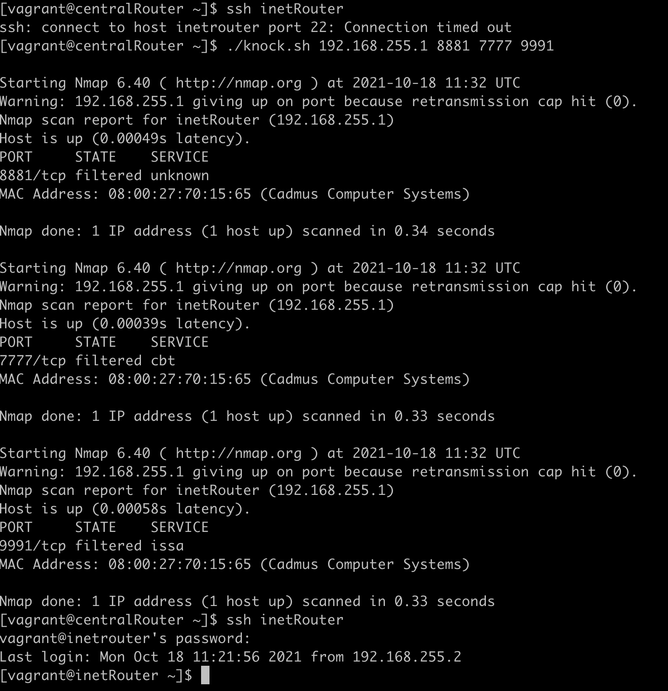
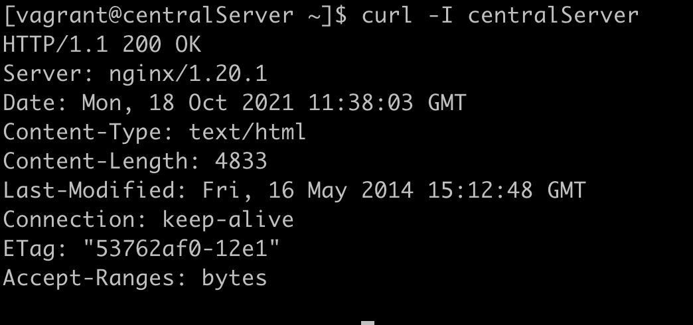
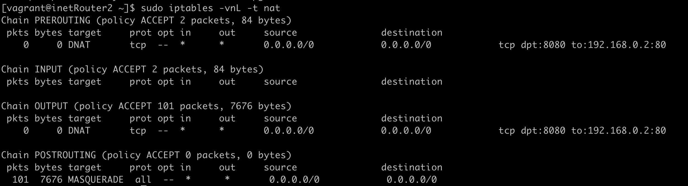
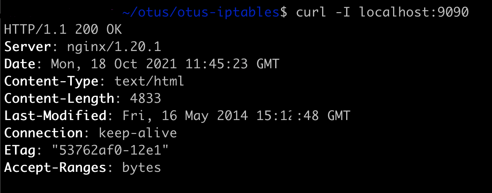

### 1. Реализовать knocking port
* centralRouter может попасть на ssh inetRouter через knock скрипт пример в материалах.

<details>
  <summary>Подключение к inetRouter работает только после выполнения скрипта knock.sh по портам 8881 7777 9991</summary>



</details>

### 2. Добавить inetRouter2, который виден(маршрутизируется (host-only тип сети для виртуалки)) с хоста или форвардится порт через локалхост.
Для inetRouter2 добавлен форвардинг порта 8080 на 9090 порт хост машины

````
        if boxname.to_s == "inetRouter2"
          box.vm.network "forwarded_port", guest: 8080, guest_ip: "192.168.250.1", host: 9090, host_ip: "127.0.0.1",  protocol: "tcp"
        end
````


### 3. Запустить nginx на centralServer.

<details>
  <summary>Nginx запущен с дефолтным конфигом на 80 порту centralServer</summary>



</details>

### 4. Пробросить 80й порт на inetRouter2 8080.

<details>
  <summary>На inetRouter2 настроен DNAT порта 8080 на 80 порт centralServer</summary>



</details>

<details>
  <summary>9090 порт на локалхосте сервера отдает ответ от nginx на centralServer</summary>



</details>

